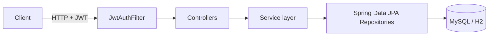

<div align="center">

# 💸 FinTrack API

**A secure, production-style REST API for personal expense tracking**

Built with Java 17 · Spring Boot 3 · Spring Security (JWT) · JPA/Hibernate · MySQL · Docker

[](https://github.com/sansa135/fintrack-api/actions/workflows/ci.yml)


</div>

---

## ✨ Features

| | |
|---|---|
| 🔐 **JWT Authentication** | Register / login, BCrypt-hashed passwords, stateless sessions |
| 🛡️ **Data Isolation** | Every query is scoped to the logged-in user, so nobody can read or edit another user's expenses |
| 🧾 **Expense CRUD** | Create, read, update and delete expenses with amount, category, description and date |
| 📄 **Pagination & Filtering** | `page`, `size`, `sort` and `category` query parameters |
| 📊 **Monthly Summary** | Total spend per category for any month, using a JPQL aggregate query |
| ✅ **Validation** | Bean Validation with clean, structured `400` error responses |
| 🧪 **Integration Tests** | MockMvc tests covering auth, CRUD, isolation and validation |
| 🐳 **Containerized** | Multi-stage Dockerfile plus `docker-compose` (app + MySQL) |
| ⚙️ **CI Pipeline** | GitHub Actions builds and tests every push |

---

## 🏗️ Architecture



**Layered design:** `Controller → Service → Repository`

- **Controllers** handle HTTP and validation only
- **Services** hold business rules and transactions (`@Transactional`)
- **Repositories** handle data access (Spring Data JPA / Hibernate)
- **DTOs (Java records)** keep API contracts separate from entities

---

## 🧰 Tech Stack

| Layer | Technology |
|---|---|
| Language | Java 17 |
| Framework | Spring Boot 3.3 (Web, Validation) |
| Security | Spring Security, JWT (jjwt), BCrypt |
| Persistence | Spring Data JPA, Hibernate |
| Database | MySQL 8 (production), H2 (local/tests) |
| Testing | JUnit 5, MockMvc, Spring Boot Test |
| DevOps | Docker, Docker Compose, GitHub Actions |
| Build | Maven |

---

## 🚀 Quick Start

### Option 1: Run locally (zero setup, uses in-memory H2)

```bash
git clone https://github.com/sansa135/fintrack-api.git
cd fintrack-api
mvn spring-boot:run
```

API runs at **http://localhost:8080**

### Option 2: Run with Docker + MySQL

```bash
docker compose up --build
```

### Run the tests

```bash
mvn verify
```

---

## 📡 API Reference

All `/api/expenses` endpoints require the header `Authorization: Bearer <token>`.

| Method | Endpoint | Description |
|:---:|---|---|
| `POST` | `/api/auth/register` | Create an account and receive a JWT |
| `POST` | `/api/auth/login` | Log in and receive a JWT |
| `POST` | `/api/expenses` | Create an expense |
| `GET` | `/api/expenses` | List your expenses (`?category=&page=&size=&sort=`) |
| `GET` | `/api/expenses/{id}` | Get one expense |
| `PUT` | `/api/expenses/{id}` | Update an expense |
| `DELETE` | `/api/expenses/{id}` | Delete an expense |
| `GET` | `/api/expenses/summary?month=2026-10` | Total spend per category for a month |

### Try it

**1. Register**
```bash
curl -X POST http://localhost:8080/api/auth/register \
  -H "Content-Type: application/json" \
  -d '{"username":"sanskruti","password":"secret123"}'
```
```json
{ "token": "eyJhbGciOiJIUzM4NCJ9..." }
```

**2. Add an expense**
```bash
curl -X POST http://localhost:8080/api/expenses \
  -H "Authorization: Bearer <token>" \
  -H "Content-Type: application/json" \
  -d '{"amount":250.50,"category":"Food","description":"Lunch","date":"2026-10-05"}'
```
```json
{
  "id": 1,
  "amount": 250.50,
  "category": "Food",
  "description": "Lunch",
  "date": "2026-10-05"
}
```

**3. Monthly summary**
```bash
curl "http://localhost:8080/api/expenses/summary?month=2026-10" \
  -H "Authorization: Bearer <token>"
```
```json
{ "Food": 250.50 }
```

**Validation error example** (`400 Bad Request`)
```json
{
  "status": 400,
  "errors": { "amount": "must be greater than or equal to 0.01" }
}
```

### Status codes

| Code | Meaning |
|:---:|---|
| `200` / `201` / `204` | Success / created / deleted |
| `400` | Validation failed |
| `401` | Missing, invalid or expired token, or bad credentials |
| `404` | Expense not found (or belongs to another user) |
| `409` | Username already taken |

---

## 🗂️ Project Structure

```
src/main/java/com/sanskruti/fintrack
├── controller/    # REST endpoints (Auth, Expense)
├── service/       # Business logic + transactions
├── repository/    # Spring Data JPA repositories
├── model/         # JPA entities (User, Expense)
├── dto/           # Request/response records
├── security/      # JWT service, auth filter, security config
└── exception/     # Global validation error handler
```

---

## 🧠 Design Decisions

- **Stateless JWT auth:** no server-side sessions, so the API scales horizontally.
- **Ownership checks in the data layer:** `findByIdAndOwner` returns `404` for other users' records, so existence is never leaked.
- **DTOs instead of exposing entities:** keeps the API stable and prevents accidentally returning sensitive fields such as password hashes.
- **`BigDecimal` for money:** avoids floating-point rounding errors.
- **Composite index on `(owner_id, date)`:** keeps per-user listing and monthly summaries fast as data grows.
- **Profile-based config:** H2 for instant local runs, MySQL via the `mysql` profile for deployment; secrets come from environment variables.

---

## 🔒 Configuration

| Variable | Description | Default |
|---|---|---|
| `APP_JWT_SECRET` | JWT signing secret (min 32 chars). **Change in production.** | dev-only value |
| `DB_URL` | JDBC URL (mysql profile) | `jdbc:mysql://localhost:3306/fintrack` |
| `DB_USER` / `DB_PASSWORD` | Database credentials | `root` / `root` |

---

## 🛣️ Roadmap

- [ ] Swagger / OpenAPI documentation
- [ ] Monthly budget limits with alerts
- [ ] CSV export of expenses
- [ ] Refresh tokens and role-based access
- [ ] Deploy to AWS (EC2 / Elastic Beanstalk + RDS)

---

## 👩‍💻 Author

**Sanskruti Wasalwar**
B.Tech CSE, VIT Bhopal · Backend / SDE aspirant

[GitHub](https://github.com/sansa135) · [Email](mailto:sanskrutiwasalwar@gmail.com)

---

<div align="center">⭐ If you found this useful, consider giving it a star!</div>
